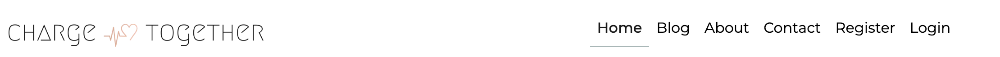
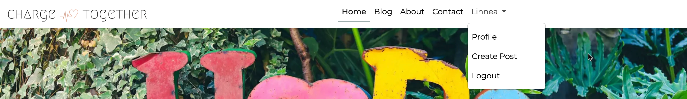
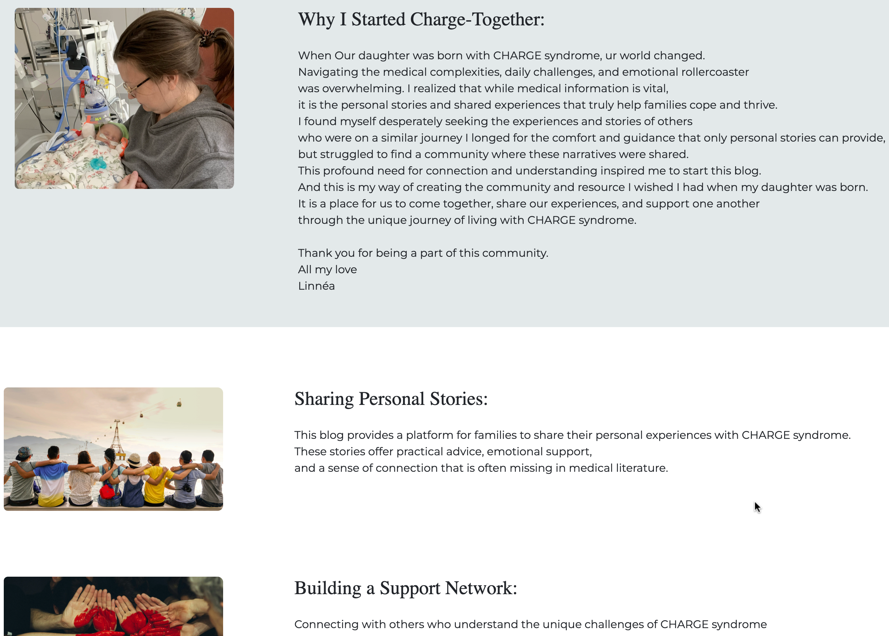
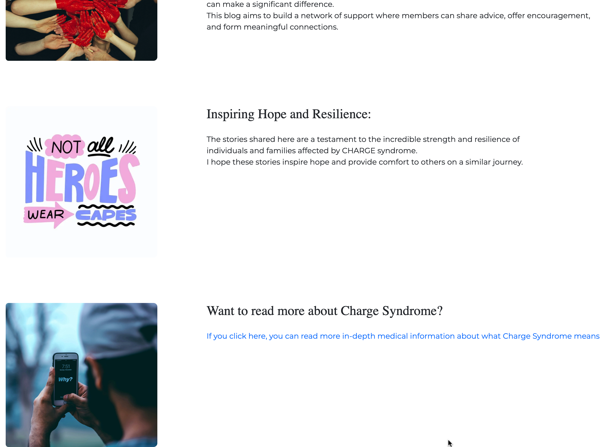

# Charge Together
## Introduction

When you, as new parents, have just found out that your child has Charge Syndrome, your life is turned upside down and the first information you find online is scary and you feel very alone. 

Therefore, this blog was created and designed for the families and relatives of, children, young people and adults, with Charge Syndrome. 

Here users can write and share their stories and experiences. And as new parents to be able to come to this blog and hopefully get some kind of peace. Because even if the road didn't turn out as they thought, it will still be good in the end and they are not alone!

## Table of Content

- [Introduction](#introduction)
- [Project Goals](#project-goals)
    - [Target Audience](#target-audience)
    - [Strategy](#project-goals)
    - [Site Owner Goals](#site-owner-goals)
    - [User Goals](#user-goals)
- [Agile Planning](#agile-planning)
    -[Epic](#epic)
    -[Implemented User Stories](#implemented-user-stories)
    -[Not implemented User Stories](#not-implemented-user-stories)
    - [Flowchart](#flowchart)
    - [Entity Relational Diagram](#entity-relational-diagram)
- [Design](#design)
    - [Wireframes](#wireframes)
    - [Colors](#color)
    - [Fonts](#font)
- [Screenshots of Features](screenshoots-of-features)
- [Future Features](#future-features)
- [Security](#security)
    - [Cross-Site Request Forgery (CSRF) Protection](#cross-site-request-forgery-csrf-protection)
    - [Django Allauth for Authentication and Authorization](#django-allauth-for-authentication-and-authorization)
    - [Restricted Features for Authenticated Users](#restricted-features-for-authenticated-users)
- [Technologies](#technologies)
- [Deployment](#deployment)
- [Testing](#testing)
    -[Validation](#validation)
    -[Lighthouse Report](#lighthouse-report)
    - [Responsiveness](responsiveness)
    - [User Stories Testing](#user-stories-testing)
    - [Automated Testing](#automated-testing)
- [Bugs](#bugs)
    - [Solved Bugs](#solved-bugs)
    - [Unresolved Bugs](#unresolved-bugs)
- [Credits](#credits)
    - [Websites](#websites)
    - [Resources](#resources)
    - [Images](#images)
    - [People](#people)

## Project Goals

The project aims to create a user-friendly platform for sharing personal stories and experiences about Charge Syndrome, which allows users to read, share, and take part in all the different experiences and stories that exist around this unusual Syndrome.

### Target Audience

The target audience includes parents, siblings, grandparents, aunts, uncles, cousins. Everyone who in some way has a relationship with someone with Charge Syndrome, and who wants to share their own stories and experiences.

### Strategy

- **Project Goals:** Define goals for sharing, reading and managing blog posts.

- **User-Centric Approach:** Understanding the needs of users who have someone in their life with the   Syndrome.

- **Engagement Strategy:** Encourage actions such as liking and commenting on blog posts, to foster a sense of community.

### Site Owner Goals

- Create a vibrant community around Charge Syndrome

- Flag the syndrome to the rest of the world

- Engage users by providing valuable content and features.

- Increase user retention through interactive features and personalized experiences.

### User Goals

- Easily find and read about other people's stories and experiences 

- Share their own stories and experiences with others in the same situation

- Interact with other users by liking and commenting on blog posts.

- Easily navigate between the different pages of the blog and get access to relevant information.

- Have a visually appealing and responsive user interface.

## Agile Planning
To implement agile planning, I wrote four different epics and divided each epic into user stories. Each user story has acceptance criteria and tasks.  I also created three different labels, *Must have*, *Should have* and *Could have*. In this way I categorized my user stories so I had a clear picture which user stories I needed to prioritize first. This was the basis for the development of the projects features

### EPIC

### Implemented User Stories

- **#1** As a Site owner I can access the admin panel, so I can see and update all of the informations, accept comments and remove inappropriate or spammy blog posts and comments, delete users.
- **#2** As a Site User I can see a list of blog posts, so I can choose which post I want to read more about.
- **#3** As a Site User I can click on a blog post, so I can read and take part in the content of the post.
- **#4** As a Site User I can easily access the "About" page, so I can find out the purpose of the blog and find a link to another page for more in-depth information.
- **#5** As a Site User I can create an account with a unique username and password, so I can start sharing my experiences and tips, as well as manage my blog posts.
- **#6** As a Registered User I can log in and out of my account, so I can access my saved blog posts, as well as write new posts.
- **#7** As a User I can upload a blog post with a title, content and a photo.
- **#8** As a User I can edit my existing blog posts, so I can update them with new information or corrections
- **#9** As a User I can create draft posts, so I can finish writing the content later.
- **#10** As a User I can delete my blog posts, so I can decide which blog posts I no longer want to be available on the platform.
- **#11** As a User I can leave comments on a post, so I can ask questions, provide feedback, or share my thoughts.
- **#16** As a User I can edit my profile, so I can keep the information upto date
- **#17** As a User I can reset my password, so I can access my account even if I have forgotten my password

### Not implemented User Stories

- **#12** As a User I can like and save blog posts that I find interesting, so I can access them later in my saved blog posts
- **#13** As a User I can view my profile, so I can see the Blog post I've submitted, my liked blog posts, and saved blog posts
- **#14** As a User I can delete my profile, so it will be removed from the database
- **#15** As a User I can visit other people's profiles, so I can read their bios
- **#18** As a User I can edit and delete my comments, so I can manage my comments on the blog.
- **#19** As a User I can use the contact form, so I can contact the admin of the blog
- **#20**  As a Site user I can access a page with a medical information, so I can read and gain a more in-depth understanding of what the syndrome entails.
- **#21** As a Developer I need to implement different error pages, so I can alert users when something goes wrong
- **#22** As a User I can be notified when someone comments on one of my blog posts, so I can respond if necessary
- **#23** As a User I can receive push notifications for new comments on the same blog posts I have commented on., so I can be updated in the conversion

### Flowchart
I drew a flowchart using [Figma](https://www.figma.com/) and my ipad,

### Entity Relational Diagram

As part of designing my website, I planned and drew my models on my Ipad using [Figma](https://www.figma.com/).
The planned models may differ from the result, and some planned models may not be implanted in the final result

## Design

### Wireframes

I used [Figma](https://www.figma.com/) as a tool when creating my wireframes.

- Home

- About

- Contact

- Register

- Login

- Profile

- Create Post

- Logout

### Colors

I used the [Color](https://coolors.co) tool 'image picker' where I used the header image to get compatible colors. I chose a gray green color from the image that I also lowered the saturation so I got a lighter green with it.

- Soft-Green; #6a8c8f30
- Grey-Green: #24494c71

### Fonts

- I chose to have Gb Garamond for the main headings as it is beautiful in its simplicity and readable, I chose serif as the fallback font.
- For the paragraphs I chose to have Roboto as it is also beautiful in its simplicity and readable, and here again I chose serif as the fallback font

## Screenshots of Features 

**Below you can see screenshots of how the blog looks, both as a non-logged-in user and as a logged-in user.**

### Header

*This is what the header looks like when you are not logged in. The logo is a simple design that I made myself.  The page that is active is marked with a solid line.*

*When the user are logged in, the header changes and instead of register and login the user now see their own username.*
*And in the dropdown menu the user can go to their profile, create a blog post or log out*

### Landing Page

*This is the landing page, beautiful and inviting in its simplicity.*

*When the user logs in, they come to the landing page and here a message is displayed that the user is logged in with their username*

### Blog page

*This page shows all the blog posts available. Here, the user also sees how many people have liked and commented on the posts*

### Detailview

*Users can click on a post to read a more detailed text. here too the users can see how many people have liked the post and who has left a comment. To like or leave a comment, the users needs to be logged in or create an account.*

#### Loged in Detailview

If the users are logged in and clicks on their own blog post, the user can edit or delete their own post. And they can leave a comment

#### Leave a Comment

*When the users press the button, They will be taken to a form where they can leave their comment*

*After pressing the Submit button, users are returned to the blog page and receive a notification that their comment has been submitted.*

*When the user returns to the post, they can now see their own comment*

### The likes

*The user can also see if they have liked or disliked the post. If they liked the post, the heart is black, and if they click again, they take their like back and the heart turns white. The numbers next to the heart increase if the user likes the post and decrease if they return their like*

### About Page

*Here the users can read about why the blog was created and its purpose. Here is also a link if the users want to read  more in-depth facts about Charge syndrome*

*Here, users can get in touch with the web owner*

### Contact Page

*Here users can register if they want to become part of the community. If they are already part of this community, they will be directed to the sign in form.*

### Sign up/Sign In Page

*Here the users log in, if they are not already part of the community they are directed to the sign up form.*

## Future Features

## Security
### Cross-Site Request Forgery (CSRF) Protection

- Implementing CSRF protection helps prevent malicious websites from executing unauthorized actions on behalf of authenticated users.
- Django provides built-in CSRF protection by including a CSRF token with each form submission and verifying it on the server side.

### Django Allauth for Authentication and Authorization

- Django Allauth is an authentication and authorization framework that provides features like registration, login, password management, and social authentication.
- It ensures secure user authentication and authorization processes.

### Restricted Features for Authenticated Users

- Certain features, such as creating, editing, or deleting blog posts and profiles, are reserved for authenticated users only.
- By requiring users to be logged in to access these features, the application enhances security and ensures that sensitive operations are performed by authorized individuals only.

#### Typography

## Languages/Technolgies
This Project is built using various technologies.

- **Django 5.0.6:** A Python web framework for building web applications.
- **Bootstrap 5.2.3:** A front-end framework for responsive and visually appealing design.
- **ElephantSQL:** An open-source relational database for data storage.
- **Cloudinary:** Cloud-based storage for the users uploaded images.
- **Heroku:** The platform where the project is deployed.
- **Git and GitHub:** Version control and code repository management.
- **IDE:** Vs Code (Visual Studio Code).

Added libraries can be seen in the requirements.txt file. 
Additionally, custom- python, html, django templating language, and css were all used. 
The README was written using markdown.

## Deployment

- I set up a postgreSQL server at [ElephantSQL.](https://www.elephantsql.com) 
- I made sure to adjust the settings file accordingly, to utilize that database.
- I also made sure to have my SECRET_KEY and DATABASE_URL in the env.py file.
- And made sute to add the env.py file to .gitignore.
- I installed gunicorn version 20.1.0, and added it to the requirements.txt.
- I installed whitenoise version 5.3.0 and added it to the requirements.txt. I also added it to middleware settings file.
- I also created  a path for whitenoise to collect static files in the settings file.
- I Created a Procfile, and declared it as a web process followed by the command to execute the project.
- Added a runtime.txt file to root directory, and added a supported python version as close as possible to my own.
- I run the command collectstatic, to collect static files.
- In the settings file I set **DEBUG = os.environ.get("DEVELOPMENT")** and in env.py I added; **os.environ.setdefault('DEVELOPMENT', 'True')**, so i don´t have to remember to change debug to *False* everytime I deploy to Heroku.
- I added Heroku to allowed hosts in the settings file (.herokuapp). Then I Pushed the code to GitHub.
- I went to [Heroku](https://.heroku.com) and created a new app.
- On the settings tab of my app I clicked "Reveal Config Vars" and added DATABASE_URL and SECRET_KEY.
- The DATABASE_URL got the value of my postgresql database url, and the SECRET_KEY got a complicated value that i made up of my own.
- Then I went back to the deploy tab of my app, and clicked connect to GitHub.
- I then searched for my repository and connected it to the app, and clicked Deploy branch

Here is a link to my Deployed project: 

Cloning or forking this project can be done from my GitHub repository, and 
you need to install the dependencies using the *pip install -r requirements.txt* command.

## Testing
### Validation
### Lighthouse Report
### Automated Testing
### Responsiveness
### User Stories Testing

Here I have viewed the user stories in my GitHub project, and carefully gone through my acceptance criteria for each user story.
If the criteria is met, it is marked in these tables below. 

Finally the issue for each user story in my project has been closed if the acceptance criteria was met.

- **EPIC 1 - A non-registered or registered user**.

- **EPIC 4 - The blogs Admin and Developer**

## Bugs

On the post_detail page I got a bug on the comment function, I couldn't leave a comment from the frontend

### Solved Bugs
In my view, I had only linked comments to the blog post itself. I fixed the bug by also linking the comment to the user.

### Unresolved Bugs
I currently have no bugs I am aware of.
## Credits
### Websites
### Resources
### Images
### People