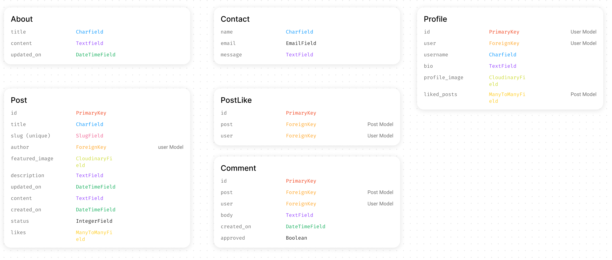
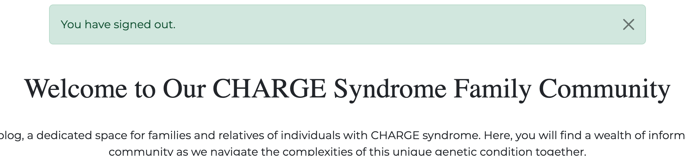

# Charge Together
## Introduction

When you, as new parents, have just found out that your child has Charge Syndrome, your life is turned upside down and the first information you find online is scary and you feel very alone. 

Therefore, this blog was created and designed for the families and relatives of, children, young people and adults, with Charge Syndrome. 

Here users can write and share their stories and experiences. And as new parents to be able to come to this blog and hopefully get some kind of peace. Because even if the road didn't turn out as they thought, it will still be good in the end and they are not alone!

## Table of Content

- [Introduction](#introduction)
- [Project Goals](#project-goals)
    - [Target Audience](#target-audience)
    - [Strategy](#project-goals)
    - [Site Owner Goals](#site-owner-goals)
    - [User Goals](#user-goals)
- [Agile Planning](#agile-planning)
    - [Epic](#epic)
    - [User Stories](#user-stories)
        - [Implemented User Stories](#implemented-user-stories)
        - [Not implemented User Stories](#not-implemented-user-stories)
    - [Flowchart](#flowchart)
    - [Entity Relational Diagram](#entity-relational-diagram)
- [Design](#design)
    - [Wireframes](#wireframes)
    - [Colors](#color)
    - [Fonts](#font)
- [Screenshots of Features](#screenshoots-of-features)
    - [Header](#header)
    - [Landing Page](l#anding-page)
    - [Blog page](#blog-page)
    - [Detailview](#detailview)
        - [Loged in Detailview](#loged-in-detailview)
        - [Leave a Comment](#leave-a-comment)
        - [The likes](#the-likes)
    - [Profile Page](#profile-page)
    - [Create Post](#create-post)
        - [Draft or Published](#draft-or-published)
    - [Edit Post](#edit-post)
    - [Delete Post](#delete-post)
    - [Logout](#logout)
    - [About Page](#about-page)
    - [Contact Page](#contact-page)
    - [Sign up](#sign-up)
    - [Sign In](#sign-in)
    - [Various ERRORS](#various-errors)
- [Future Features](#future-features)
- [Security](#security)
    - [Cross-Site Request Forgery (CSRF) Protection](#cross-site-request-forgery-csrf-protection)
    - [Django Allauth for Authentication and Authorization](#django-allauth-for-authentication-and-authorization)
    - [Restricted Features for Authenticated Users](#restricted-features-for-authenticated-users)
- [Technologies](#technologies)
- [Deployment](#deployment)
- [Testing](#testing)
    - [Validation](#validation)
    - [Lighthouse Report](#lighthouse-report)
    - [Responsiveness](responsiveness)
    - [User Stories Testing](#user-stories-testing)
    - [Automated Testing](#automated-testing)
- [Bugs](#bugs)
    - [Solved Bugs](#solved-bugs)
    - [Unresolved Bugs](#unresolved-bugs)
- [Credits](#credits)
    - [Websites](#websites)
    - [Resources](#resources)
    - [Images](#images)
    - [People](#people)

## Project Goals

The project aims to create a user-friendly platform for sharing personal stories and experiences about Charge Syndrome, which allows users to read, share, and take part in all the different experiences and stories that exist around this unusual Syndrome.

### Target Audience

The target audience includes parents, siblings, grandparents, aunts, uncles, cousins. Everyone who in some way has a relationship with someone with Charge Syndrome, and who wants to share their own stories and experiences.

### Strategy

- **Project Goals:** Define goals for sharing, reading and managing blog posts.

- **User-Centric Approach:** Understanding the needs of users who have someone in their life with the   Syndrome.

- **Engagement Strategy:** Encourage actions such as liking and commenting on blog posts, to foster a sense of community.

### Site Owner Goals

- Create a vibrant community around Charge Syndrome

- Flag the syndrome to the rest of the world

- Engage users by providing valuable content and features.

- Increase user retention through interactive features and personalized experiences.

### User Goals

- Easily find and read about other people's stories and experiences 

- Share their own stories and experiences with others in the same situation

- Interact with other users by liking and commenting on blog posts.

- Easily navigate between the different pages of the blog and get access to relevant information.

- Have a visually appealing and responsive user interface.

## Agile Planning

To implement agile planning, I wrote four different epics and divided each epic into user stories. Each user story has acceptance criteria and tasks. I also created three different labels, *Must have*, *Should have* and *Could have*. In this way I categorized my user stories so I had a clear picture which user stories I needed to prioritize first. This was the basis for the development of the projects features. 

### EPIC

Since all User Stories have different labels, the number of purple ticks in each EPIC will vary.

### User Stories

All user stories that have the label *must have* are implemented, then there are some with the label *should have*. Of those that are not implemented, some have the *should have* label and some have the *could have* label.

#### Implemented User Stories

- **#1** As a Site owner I can access the admin panel, so I can see and update all of the informations, accept comments and remove inappropriate or spammy blog posts and comments, delete users.
- **#2** As a Site User I can see a list of blog posts, so I can choose which post I want to read more about.
- **#3** As a Site User I can click on a blog post, so I can read and take part in the content of the post.
- **#4** As a Site User I can easily access the "About" page, so I can find out the purpose of the blog and find a link to another page for more in-depth information.
- **#5** As a Site User I can create an account with a unique username and password, so I can start sharing my experiences and tips, as well as manage my blog posts.
- **#6** As a Registered User I can log in and out of my account, so I can access my saved blog posts, as well as write new posts.
- **#7** As a User I can upload a blog post with a title, content and a photo.
- **#8** As a User I can edit my existing blog posts, so I can update them with new information or corrections
- **#9** As a User I can create draft posts, so I can finish writing the content later.
- **#10** As a User I can delete my blog posts, so I can decide which blog posts I no longer want to be available on the platform.
- **#11** As a User I can leave comments on a post, so I can ask questions, provide feedback, or share my thoughts.
- **#12** As a User I can like blog posts that I find interesting.
- **#16** As a User I can edit my profile, so I can keep the information upto date
- **#18** As a User I can edit and delete my comments, so I can manage my comments on the blog.
- **#19** As a User I can use the contact form, so I can contact the admin of the blog
- **#21** As a Developer I need to implement different error pages, so I can alert users when something goes wrong
- **#13** As a User I can view my profile, so I can see the Blog post I've submitted.

*User story #20 below is reminiscent of an acceptance criteria under about page and is therefore partially implemented as I decided to put medical links under about page instead of having a completely separate page for this. Instead of deleting this story, I chose to report it this way.*

- **#20**  As a Site user I can access a page with a medical information, so I can read and gain a more in-depth 

#### Not implemented User Stories

- **#14** As a User I can delete my profile, so it will be removed from the database
- **#15** As a User I can visit other people's profiles, so I can read their bios
- **#17** As a User I can reset my password, so I can access my account even if I have forgotten my password
understanding of what the syndrome entails.
- **#22** As a User I can be notified when someone comments on one of my blog posts, so I can respond if necessary
- **#23** As a User I can receive push notifications for new comments on the same blog posts I have commented on., so I can be updated in the conversion
- **#28** As a User I can see all the blog post i have liked on my profile, so I can easily go back and read them again

### Flowchart

I drew a flowchart using [Figma](https://www.figma.com/) and my ipad,

### Entity Relational Diagram

As part of designing my website, I planned and drew my models on my Ipad using [Figma](https://www.figma.com/).

## Design

### Wireframes

I used [Figma](https://www.figma.com/) as a tool when creating my wireframes.

- Home

- About

- Contact

- Register

- Login

- Profile

- Create Post

- Logout

### Colors

I used the [Color](https://coolors.co) tool 'image picker' where I used the header image to get compatible colors. I chose a gray green color from the image that I also lowered the saturation so I got a lighter green with it.

- Soft-Green; #6a8c8f30
- Grey-Green: #24494c71

### Fonts

- I chose to have EB Garamond for the main headings as it is beautiful in its simplicity and readable, I chose serif as the fallback font.
- For the paragraphs I chose to have Roboto as it is also beautiful in its simplicity and readable, and here again I chose serif as the fallback font.

## Screenshots of Features 

**Below you can see screenshots of how the blog looks, both as a non-logged-in user and as a logged-in user.**

(<small>the font in my screenshots does not match the finished project and the font choice I discuss above, this is because I noticed a typo in my css and the font I changed to was not saved properly. But at the time of writing it is the correct font in the finished project</small>)

### Header

This is what the header looks like when you are not logged in. The logo is a simple design that I made myself.  The page that is active is marked with a solid line.

When the user are logged in, the header changes and instead of register and login the user now see their own username.
And in the dropdown menu the user can go to their profile, create a blog post or log out

### Landing Page

This is the landing page, beautiful and inviting in its simplicity.

### Blog page

This page shows all the blog posts available. Here, the user also sees how many people have liked and commented on the posts

### Detailview

Users can click on a post to read a more detailed text. here too the users can see how many people have liked the post and who has left a comment. To like or leave a comment, the users needs to be logged in or create an account.

#### Loged in Detailview

If the users are logged in and clicks on their own blog post, the user can edit or delete their own post. And they can leave a comment

#### Leave a Comment

When the users press the button, They will be taken to a form where they can leave their comment

After pressing the Submit button, users are returned to the blog page and receive a notification that their comment has been submitted.

When the user returns to the post, they can now see their own comment

Users can edit and delete their own comments.

When users choose to edit their comments, they are taken to a form. when they click update, they get a success message

When users choose to delete, they have two choices, either click the back button and be directed back to the post, or confirm and receive a successful message that the comment has been deleted

#### The likes

The user can also see if they have liked or disliked the post. If they liked the post, the heart is black, and if they click again, they take their like back and the heart turns white. The numbers next to the heart increase if the user likes the post and decrease if they return their like

### Profile Page

When the user goes to their profile, all posts, both published and drafts that the user has created, are displayed. The user's bio and selected profile picture are also displayed here. The users can also see their name, when they created the account and how many posts they have written.

They can also update their profile.

When they click on update, they receive a successful message that their profile has been updated

### Create Post

When users click on create post in the dropdown menu, they come to the create post form.T he user can choose to save the post as a draft or publish the post right away

If the user does not fill in all the fields in the form when they click the create post button, the user will be directed to the missing field and a blue frame will mark the missing field

#### Draft or Published

The user can choose to save their post as a draft or publish the post directly.

If the user chooses to save the post as a draft, a success message is displayed and the post is displayed only on the user's profile page.

If the user chooses to publish the post immediately, a success message will appear and the post will appear on both the blog page with all other published posts and on the user's profile page.

### Edit Post

When the user chooses to edit their post, they are brought to the same form as when they created the post but this time it is already filled with the previous content and it is only for the user to add or remove content.

When the user is satisfied and clicks on edit post, they are redirected to the blog page where they receive a successful message and can see that their update was successful when the new update is displayed. They can also see that the update was successful on their profile.

If a user who is not authorized tries to access another user's blog post and edits, this error page is displayed

### Delete Post

When the user clicks delete, they come to a page where they can either confirm or go back

If the user clicks on the back button, they are directed back to the detailview.

If, however, the user clicks on confirm, they are directed to the blog page where they receive a success message and see that it was successful, as the post that was deleted is no longer among the most recent blog posts. The deleted post also disappears from the user's profile as further confirmation that it has been removed.

### Logout

When the user clicks on log out in the dropdown menu, they will be taken to a page where they can choose to either log out or cancel.

*If the user chooses to cancel, they are redirected back to their profile.*

*If the user chooses to confirm, they are redirected to the landing page with a successful message.*

### About Page

Here the users can read about why the blog was created and its purpose. Here is also a link if the users want to read  more in-depth facts about Charge syndrome. When the user clicks on the link, that page opens in a new window.

### Contact Page

Here, users can get in touch with the web owner

Once the user has filled out the contact form and clicked the send button, they will receive a thank you message letting them know their message was sent successfully.

### Sign Up

Here users can register if they want to become part of the community. If they are already part of this community, they will be directed to the sign in form and

When the user is about to register and enters either a shortened password, only numbers, a password that is too common or that the passwords do not match, this is shown on the screen with an explanation in red text. This applies even if the user were to fill in a username that already exists

When the user has filled in the registration form correctly, they are redirected to the landing page with a successful message

### Sign In

Here the users log in, if they are not already part of the community they are directed to the sign up form.

When the user logs in, they come to the landing page and here a message is displayed that the user is logged in with their username

When the user fills in the password or username, this red text is displayed.

### Various ERRORS

If a user tries to do something they are not authorized to do, a 403 error is displayed.

When the user tries to reach a page that does not exist, a 404 error is displayed.

If there is some internal error with the page, 500 error is displayed with a message.

## Future Features

- Users can visit each other's profiles

- Users can also see all posts that they themselves have liked

- Users can change passwords

- basically implement the used stories that are not implemented

## Security

### Cross-Site Request Forgery (CSRF) Protection

- Implementing CSRF protection helps prevent malicious websites from executing unauthorized actions on behalf of authenticated users.
- Django provides built-in CSRF protection by including a CSRF token with each form submission and verifying it on the server side.

### Django Allauth for Authentication and Authorization

- Django Allauth is an authentication and authorization framework that provides features like registration, login, password management, and social authentication.
- It ensures secure user authentication and authorization processes.

### Restricted Features for Authenticated Users

- Certain features, such as creating, editing, or deleting blog posts and profiles, are reserved for authenticated users only.
- By requiring users to be logged in to access these features, the application enhances security and ensures that sensitive operations are performed by authorized individuals only.

## Languages/Technolgies

This Project is built using various technologies.

- **Django 4.1.7:** A Python web framework for building web applications.
- **Bootstrap 5.2.3:** A front-end framework for responsive and visually appealing design.
- **ElephantSQL:** An open-source relational database for data storage.
- **Cloudinary:** Cloud-based storage for the users uploaded images.
- **Heroku:** The platform where the project is deployed.
- **Git and GitHub:** Version control and code repository management.
- **IDE:** Vs Code (Visual Studio Code).

Added libraries can be seen in the requirements.txt file. 
Additionally, custom- python, html, django templating language, and css were all used. 
The README was written using markdown.

## Deployment

- I set up a postgreSQL server at [ElephantSQL.](https://www.elephantsql.com) 
- I made sure to adjust the settings file accordingly, to utilize that database.
- I also made sure to have my SECRET_KEY and DATABASE_URL in the env.py file.
- And made sute to add the env.py file to .gitignore.
- I installed gunicorn version 20.1.0, and added it to the requirements.txt.
- I installed whitenoise version 5.3.0 and added it to the requirements.txt. I also added it to middleware settings file.
- I also created  a path for whitenoise to collect static files in the settings file.
- I Created a Procfile, and declared it as a web process followed by the command to execute the project.
- Added a runtime.txt file to root directory, and added a supported python version as close as possible to my own.
- I run the command collectstatic, to collect static files.
- In the settings file I set **DEBUG = os.environ.get("DEVELOPMENT")** and in env.py I added; **os.environ.setdefault('DEVELOPMENT', 'True')**, so i don´t have to remember to change debug to *False* everytime I deploy to Heroku.
- I added Heroku to allowed hosts in the settings file (.herokuapp). Then I Pushed the code to GitHub.
- I went to [Heroku](https://.heroku.com) and created a new app.
- On the settings tab of my app I clicked "Reveal Config Vars" and added DATABASE_URL and SECRET_KEY.
- The DATABASE_URL got the value of my postgresql database url, and the SECRET_KEY got a complicated value that i made up of my own.
- Then I went back to the deploy tab of my app, and clicked connect to GitHub.
- I then searched for my repository and connected it to the app, and clicked Deploy branch

Here is a link to my Deployed project : 

Cloning or forking this project can be done from my GitHub repository, and 
you need to install the dependencies using the *pip install -r requirements.txt* command.

## Testing
### Validation

Python was validated using [PEP8 CI python linter](https://pep8ci.herokuapp.com/), with no errors or warnings.

CSS was validated using [jigsaw(]https://jigsaw.w3.org/css-validator/#validate_by_input), with no errors or warnings.

HTML was validated using [W3C Validator](https://validator.w3.org/#validate_by_uri), with no errors or warnings.

### Lighthouse Report

The following are lighthouse reports from my different pages:

- Home

- Blog

- Detail View

- About

- Contact

- Register

- Sign In

- Profile

- Edit Profile

- Create Post

- Edit Post

- Delete Post

- Comment

- Edit Comment

- Delete Comment

### Manual Testning

I chose to test all functions manually, as I am completely new to automatic testing and time was not on my side to really get into this.

- Header/ navigation

- Blog page / Detail View

- Comment / Like

- About page

- Contact page

- Register Page

- Sign in page

- Profile page

- Create Post page

- Sign out Page

- Admin

### Responsiveness

during the course of the project, I tested responsiveness on my Macbook Pro
ipad 12.9 screen and iphone 15 and used google devtool for screens I didn't have at home and test on
### User Stories Testing

Here I have tested all my four EPICs and their associated User stories that have been implemented. I have carefully reviewed each User story's acceptance criteria and made sure they are met. Every user story that is implemented and that has met the criteria is listed as done in the project's Kanban board
To see the Kanban board please click [here](https://github.com/users/Linnea87/projects/10)

- **EPIC#1 - A non-registered or registered user**.

- **EPIC#2 - Manage blog posts**

- **EPIC#3 -  Manage the profile**

- **EPIC#4 - The blogs Admin and Developer**

## Bugs

On the post_detail page I got a bug on the comment function, I couldn't leave a comment from the frontend

### Solved Bugs
In my view, I had only linked comments to the blog post itself. I fixed the bug by also linking the comment to the user.

### Unresolved Bugs
I currently have no bugs I am aware of.

## Credits

### Websites
- The basic code structure of this project has been inspired from; 
[Dee Mc](https://www.youtube.com/@IonaFrisbee)  
[Codemy.com](https://www.youtube.com/@Codemycom)
[Code Institute](https://codeinstitute.net/) "I think therefore i blog"

- As always used stack overflow for Troubleshooting 
[Stack overflow](https://stackoverflow.co/teams/)

- The javascript in my profile View are taken from 
[W3school](https://www.w3schools.com/)

- Took help of chatgtp for inspiration for the content of the blog posts 
[Chatgtp](https://openai.com/)

### Images

- The header image, as well as all images (before the top one) in the about page are taken from [Unsplash](https://unsplash.com/)

- The Logo did a designed here [Logo](https://logo.com/editor/colors)

### People

I want to thank my mentor Graeme. Allways there with useful advice and support.
this time I also had the support of our Code Institute tutors